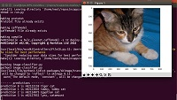
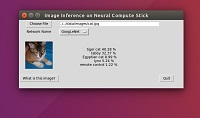
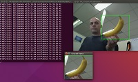
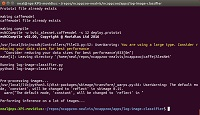
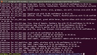
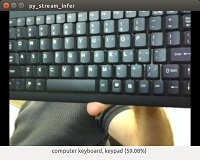
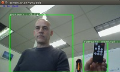
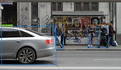
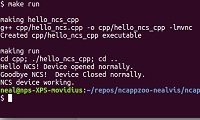
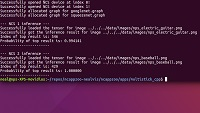

# Applications for the NCSDK

This directory contains subdirectories for applications that make use of the NCSDK.  Typically the applications here make use of one or more of the neural networks in the caffe, and/or tensorflow directories.  They are also intended to be more involved and provide more of a real world application of the networks rather than simply serving as an example of the technology.
The sections below are categorized by application type and present the currently available applications in the repository in succinct lists.

Each application directory has a README that explains how to build and run it, as well as a Makefile that automates the steps for you.  The links in the tables below will take you to the README files for each application.

## Image Classification Applications
Image classification applications typically use one of the image classification networks in the repository to classify an image as to it's likeliness to be in each of the classes on which a network was trained.
For a step by step tutorial on how to build an image classification network look at [Build an Image Classifier in 5 steps](https://movidius.github.io/blog/ncs-image-classifier/) at the Intel® Movidius™ Neural Compute Stick Blog

|Image Classification Application| Description |++++++Thumbnail++++++|
|---------------------|-------------|-------|
|[image-classifier](image-classifier/README.md)    *Canonical Image Classification Example| Python Multiple Networks Project that accompanies the blog [https://movidius.github.io/blog/ncs-image-classifier/.](https://movidius.github.io/blog/ncs-image-classifier).  If you are getting started with image classification this is a good first stop. | 
|[MultiStick_GoogLeNet](MultiStick_GoogLeNet/README.md) | Python Caffe GoogLeNet Image classification on multiple devices. Shows scalability by using one GUI window to show inferences on a single stick and another window to show multiple sticks||
|[MultiStick_TF_Inception](MultiStick_TF_Inception/README.md) | Python TensorFlow Inception Image classification on multiple devices.||
|[classifier-gui](classifier-gui/README.md) | Python Multiple Network GUI to select network and image to classify.||
|[gender_age_lbp](gender_age_lbp/README.md) | C++ Caffe AgeNet, GenderNet Uses AgeNet and GenderNet to predict age and gender of people in a live camera feed. The camera feed is displayed with a box overlayed around the faces and a label for age and gender of the person. The face detection is done with OpenCV.||
|[live-image-classifier](live-image-classifier/README.md) |Python Multiple Networks Performs image classification on a live camera feed.  This project was used to build a battery powered, RPi based, portable inference device (although RPi isn't required.)  You can read more about this project at this NCS developer blog https://movidius.github.io/blog/battery-powered-dl-engine/.||
|[log-image-classifier](log-image-classifier/README.md) | Python Multiple Networks Application logs results of an image classifier into a comma-separated values (CSV) file. Run inferences sequentially (and recursively) on all images within a folder. ||
|[rapid-image-classifier](rapid-image-classifier/README.md) | Python Multiple Networks Performs image classification on a large number of images. This sample code was used to validate a Dogs vs Cats classifier built using a customized version of GoogLeNet. You can read more about this project (and a step-by-step guide) here https://movidius.github.io/blog/deploying-custom-caffe-models/. ||
|[stream_infer](stream_infer/README.md) | Python Caffe SqueezeNet Uses gstreamer to grab frames from a live camera stream and run inferences on them while displaying top results in real time. ||
|[video_face_matcher](video_face_matcher/README.md) | Python TensorFlow FaceNet Uses the tensorflow/FaceNet network to identify faces in a camera video stream.  A single face image is used as the key and when a face in the video stream matches the key, a green frame is overlayed on the video feed.||
|[video_face_matcher_multipleFace](video_face_matcher_multipleFace/README.md) | Python TensorFlow FaceNet Similar to the video_face_matcher application but supports matching multiple faces||
|[topcoder_example](topcoder_example/README.md) | Python Multiple Networks Contains all supporting files needed to generate submissions.zip file, which would then be uploaded to the TopCoder leaderboard for automatic scoring of the NCS competition described here: https://developer.movidius.com/competition.| this program is a can be useful as a reference  for doing accuracy calculations.|

## Object Detection Applications
Object detection appliations make use of one of the [object detection networks](TODO) in the repository to detect objects within an image.  The object detection networks typically determine where objects are within the image as well as what type of objects they are.

|Object Detection Application| Description |+++++Thumbnail+++++ |
|---------------------|-------------|-------|
|[birds](birds/README.md) | Python Caffe Tiny Yolo, GoogLeNet Detects and identifies birds in photos by using Yolo Tiny to identify birds in general and then GoogLeNet to further classify them. Displays images with overlayed rectangles bird classification. ||
|[stream_ty_gn](stream_ty_gn/README.md) | Python Caffe Tiny Yolo, GoogLeNet Sends frames of live camera stream to Tiny Yolo for object detection and then crops each object and sends that to GoogLeNet for further classification. This application requires two NCS devices, one for each network.  Look at this example for straight forward example, but look at the threaded version if you are interested in better performance. ||
|[stream_ty_gn_threaded](stream_ty_gn_threaded/README.md) | Python Caffe Tiny Yolo, GoogLeNet Sends frames of live camera stream to Tiny Yolo for object detection and then crops each object and sends that to GoogLeNet for further classification. This application requires two NCS devices, one for each network.  This is a threaded, better performing, and slightly more complex version of the stream_ty_gn application.   ||
|[street_cam](street_cam/README.md) | Python Caffe TinyYolo, GoogLeNet Processes a video file (presumably produced by a street camera) and overlays boxes and labels around the objects detected.  Objects are detected by Tiny Yolo and then further classified by GoogLeNet. This requires two NCS devices.  Look at this example for straight forward example, but look at the threaded version if you are interested in better performance.||
|[street_cam_threaded](street_cam_threaded/README.md) | Python Caffe TinyYolo, GoogLeNet Processes a video file (presumably produced by a street camera) and overlays boxes and labels around the objects detected.  Objects are detected by Tiny Yolo and then further classified by GoogLeNet. This requires two NCS devices.  This is a threaded, better performing, and more complex version of the street_cam application.||
|[video_objects](video_objects/README.md) | Python Caffe SSD MobileNet Processes a video file and overlays boxes and labels around the objects detected and displays results in a GUI as frames are available.||

## Misc Applications
Miscellaneous applications use the NCSDK in various ways that don't fit into any of the above categories but can still be interesting.

|Misc Application| Description |+++++Thumbnail+++++ |
|---------------------|-------------|-------|
|[benchmarkncs](benchmarkncs/README.md) | Python Multiple Network Outputs FPS numbers for networks in the repository that take images as input. If multiple NCS devices are plugged in will give numbers for one device and for multiple.||
|[hello_ncs_cpp](hello_ncs_cpp/README.md) | C++ No Networks Simple example demonstrating how compile, run, as well as open and close a device in C++ application.||
|[hello_ncs_py](hello_ncs_py/README.md) | Python No Networks Simple example demonstrating how open and close a device in Python and run the program.||
|[multistick_cpp](multistick_cpp/README.md) | Python Caffe SqueezeNet, GoogLeNet Simple example demonstrating how to use multiple devices and networks in a C++ application.||

